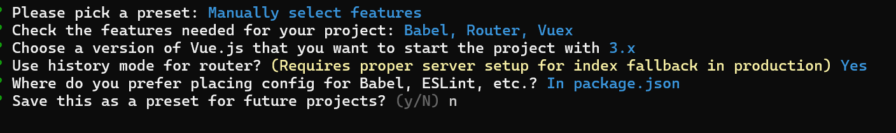

# Vue.js

## 세팅

1. node가 깔려있는지 확인
2. npm install -g @vue/cli
3. vue —version으로 버전 확인
4. vue create 폴더명
5. menual ~ 선택(맨밑) - 엔터
6. Babel, router, vuex 스페이스바로 선택 후 엔터
7. 3.x



## 실행

npm run serve

## Vue

### templeate

- 보여주고 싶은 html을 적는 곳

### app.js

- router-view
    - 내용

### router

- router-link에 적힌 내용들을 정의해놓은 것

```jsx
<template>
  <nav>
    <router-link to="/">Home</router-link> |
    <router-link to="/about">About</router-link> |
    <router-link to="/hello">Hello</router-link>
  </nav>
  <!-- 해당 컴포넌트에서 정의해 놓은 view 출력 -->
  <router-view/>
</template>

// /router/index.js
const routes = [
  {
    path: '/',
    name: 'home',
    component: HomeView
  },
  {
    path: '/hello',
    name: 'hello',
    component: VueHello
  },
  {
    path: '/about',
    name: 'about',
    // route level code-splitting
    // this generates a separate chunk (about.[hash].js) for this route
    // which is lazy-loaded when the route is visited.
    component: () => import(/* webpackChunkName: "about" */ '../views/AboutView.vue')
  }
]
```

### 변수

- 변수는 `{{ 변수 }}`로 사용한다.

### v-bind

- 데이터를 바인딩

```jsx
<!-- v-bind:의 약어 = : -->
<p :title = "msg">타이틀이 보입니다.</p>
<input type="text" v-model="seen" />
```

### v-model

- script로 작성된 데이터를 template안에 사용할 때 사용

```jsx

```

### v-if

- template안에서 조건문을 사용하고 싶을 때 사용

```jsx
<!-- 조건문 -->
<p v-if = "seen == 'test'">if가 보입니다.</p>
<p v-else-if = "seen == 'test1'">else if가 보입니다.</p>
<p v-else>else가 보입니다.</p>
```

### v-for

- `v-for=”변수 in 배열” v-bind:key=”키이름”`

```jsx
    <!-- 반복문 -->
    <ol>
      <li v-for = "todo in todos" :key="todo.id">
        {{ todo.text }}
      </li>
    </ol>
```

### 이벤트

- `v-on:”이벤트”`

```jsx
<button v-on:click="dataChange">데이터변경</button>
```

### 컴포넌트

- 정의

```jsx
// view 정의
<template>
  <table border = 1 align = "center">
    <tr>
      <th v-for="header in tableData.header">{{ header }}</th>
    </tr>

    <tr v-for="data in tableData.rows">
      <!-- 반복문이나 조건문을 사용할 태그가 부족할 때에는 temlplate을 사용한다 -->
      <template v-for="header in tableData.header">
        <template v-for="(value, key, idx) in data">
          <td v-if="header == key">{{ value }}</td>
        </template>
      </template>
    </tr>
  </table>
</template>

// 컴포넌트 정의
<script>
export default{
  name:'BasicTable',
  props: ['tableData']
}
</script>
```

- 사용

```jsx
<template>
  <div class="about">
	  <BasicTable :tableData="tableData"/>
  </div>
</template>

export default{
  name:'VueHello',
  // 데이터 정의
  data(){
    return{
      msg: "Hello Vue JS",
      seen: "test",
      todos: [
        {id:1,text:'yellow'},
        {id:2,text:'grenn'},
        {id:3,text:'blue'}
      ],
      tableData:{
        header: ['type', 'title', 'no'],
        rows: [
          {type: 1, no:1, title: 'textTitle111'},
          {type: 2, no:2, title: 'textTitle222'},
          {type: 1, no:3, title: 'textTitle333'},
          {type: 2, no:4, title: 'textTitle444'},
          {type: 1, no:5, title: 'textTitle555'},
          {type: 2, no:6, title: 'textTitle666'},
        ]
      }
    }
  },
  // 함수 정의
  methods: {
    dataChange(){
      // data안의 데이터에 접근할 때는 this
      this.todos =[
        {id:1,text:'black'},
        {id:2,text:'White'},
        {id:3,text:'red'},
        {id:4,text:'brown'}
      ]
    }
  },
  // 사용할 컴포넌트 정의
  components:{
    TodoItem,
    BasicTable
  }
}

</script>

```